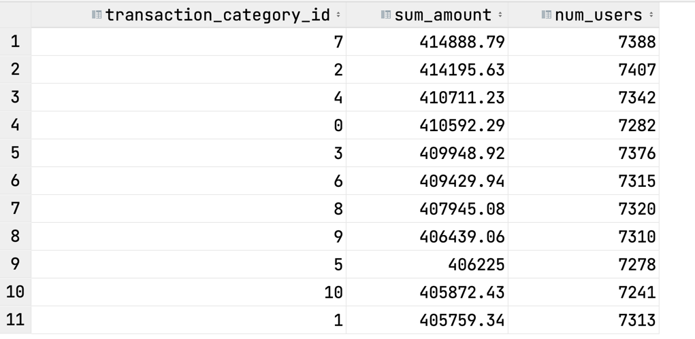
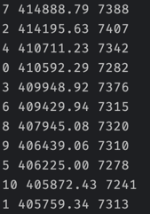
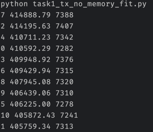

# Task 1

I assume for this task that we have only one machine and no multithreading. 


The solution of this task depends on the assumption whether the users.csv fits into memory or not.

If it does, then we can apply a solution in [Task1_tx_memory_fit](Task1_tx_memory_fit.py)
If it does not, then we can apply a solution in [Task1_tx_memory_not_fit](task1_tx_memory_not_fit.py)


# Solution

To run a calculation you can just run make in the terminal
```bash
make
```

After csv generation for an SQL query we have this result:



for a python script (task1_tx_memory_fit.py) we have this result:



for a python script (task1_tx_memory_not_fit.py) we have this result:



