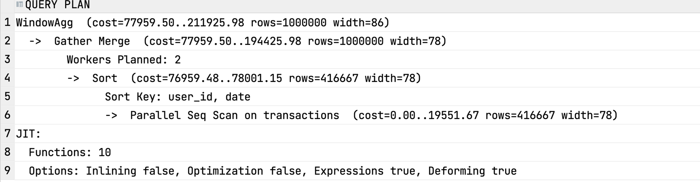

# Task 
For every transaction of a user it should compute the number of transactions the user had within the previous seven days. 

# Solution 
Fortunately, PostgreSQL works well with RANGE frame clause and dates.
So we can just use ```RANGE BETWEEN``` clause to get the number of transactions the user had within the previous seven days.

I use ```Interval 1 day``` to exclude current day of the transaction 


```postgresql 
SELECT transaction_id,
       user_id,
       date, 
       COUNT(transaction_id)
            OVER (PARTITION BY user_id
                  ORDER BY date
                  RANGE BETWEEN INTERVAL '7 days' PRECEDING AND INTERVAL '1 day' PRECEDING
                )
  FROM transactions
```

# Internals 
Let's assume we are running the query on PostgreSQL database. Also i will not dive deep about I/O, memory cache and other details.

After sending this query there are such steps:
1. Client is setting up a connection with server 
2. Server starting background processes 
3. Client sends a query to the server
4. Server parses the query and creates a plan
5. Server executes the plan
6. Server sends the result to the client
7. Client receives the result

During the phase 4, server checks the metadata information about the tables and indexes.
It contains information about the columns, indexes, constraints, etc. and statistics about the data.

If we check the plan of the query, we can see that the query is using ```Sort``` and ```WindowAgg``` operators. 



So first there are N workers who sort the data by user_id, date keys. 
Then the results are merged to combine data.
Then there is a coordinator who performs the window function. 
