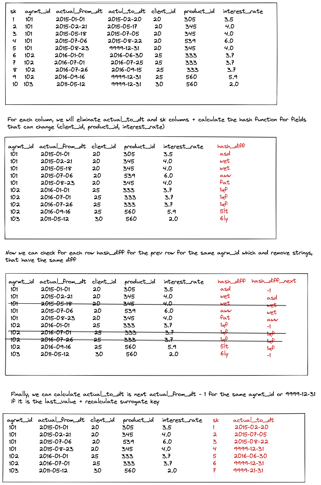

# Task 
Write an SQL script to create a new table ```dim_dep_agreement_compacted```, where all such redundant records will be "collapsed".

# Solution 

```postgresql
CREATE TABLE dim_dep_aggreement_compacted AS
WITH delta AS
(
SELECT agrmnt_id, actual_from_dt, client_id, product_id, interest_rate,
       md5('~cl:' || coalesce(text(client_id), '~')
        || '~pr:' || coalesce(text(product_id), '~')
        || '~ir:' || coalesce(text(interest_rate), '~')) AS hash_diff,
       COALESCE(LAG(
           md5('~cl:' || coalesce(text(client_id), '~')
            || '~pr:' || coalesce(text(product_id), '~')
            || '~ir:' || coalesce(text(interest_rate), '~')))
           OVER (PARTITION BY client_id order by actual_from_dt),
           '~inf')
           AS hash_diff_lead
  FROM dim_dep_agreement
)
SELECT ROW_NUMBER() OVER (ORDER BY client_id, actual_from_dt) AS sk,
       agrmnt_id,
       actual_from_dt,
       COALESCE(
           (LEAD(actual_from_dt)
               OVER (PARTITION BY client_id ORDER BY actual_from_dt)
           - interval '1 day')::date,
           '9999-12-31'::date
        ) AS actual_to_dt,
        client_id,
        product_id,
        interest_rate
   FROM delta
 WHERE hash_diff != hash_diff_lead
;
```
In delta CTE we calculate the hash of the current row and the next row. 
 
If the hash is different, then we keep the current row. 
I recalculate actual_to_dt, using lead function, and subtracting 1 day.
For surrogate keys we recalculate it using row_number function.

# Details of the solution

